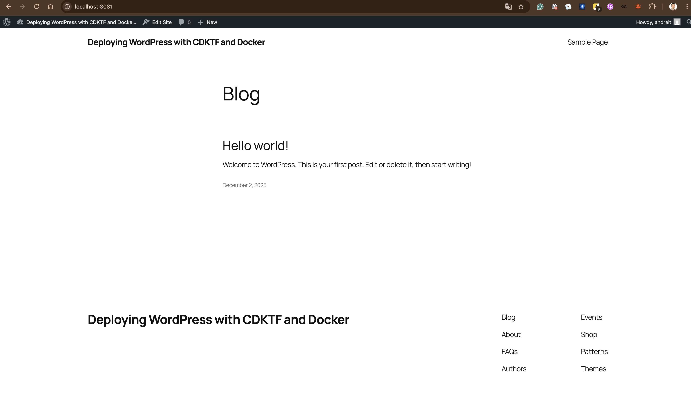
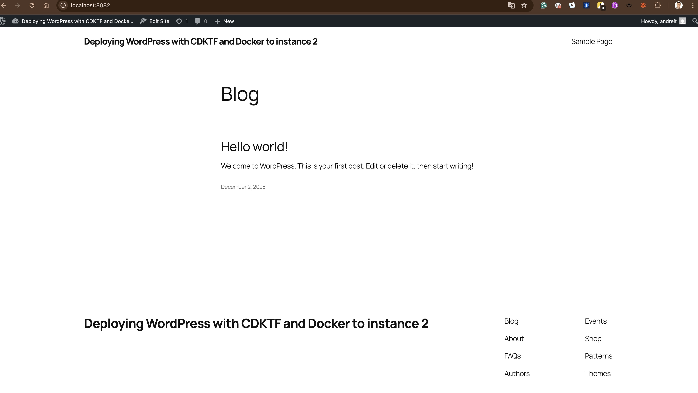

Here is screeshots:

The all JS files exist in the folder ./homework_cdktf

I faced the issue with version of Node, first I used 18.20.8 but it needs >=20.9.0
Then I faced Conflicting peer dependency: cdktf.
Also I faced "Error establishing a database connection" I found that  WORDPRESS_DB_HOST=mysql doesn't match the MySQL container name mysql-${id} (e.g., mysql-StackOne). In Docker, containers resolve by container name.